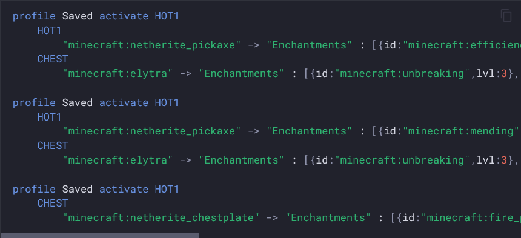

# Pygment profiles syntax

A pygments lexer to support Inventory-Profiles-Next's profiles syntax.



## Installation

Install it with pip:

```
pip install git+https://github.com/Inventory-Profiles-Next/pygments-profiles-syntax.git
```

Or put it in your `requirements.txt` as:

```
git+https://github.com/Inventory-Profiles-Next/pygments-profiles-syntax.git
```

## Usage

Then use it anywhere there is pygments support!

The short name is `profiles`.
